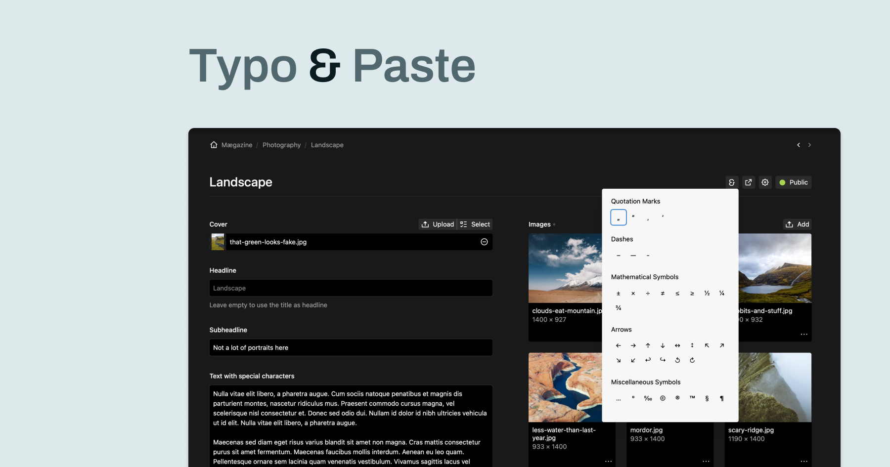
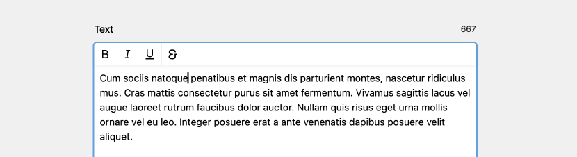
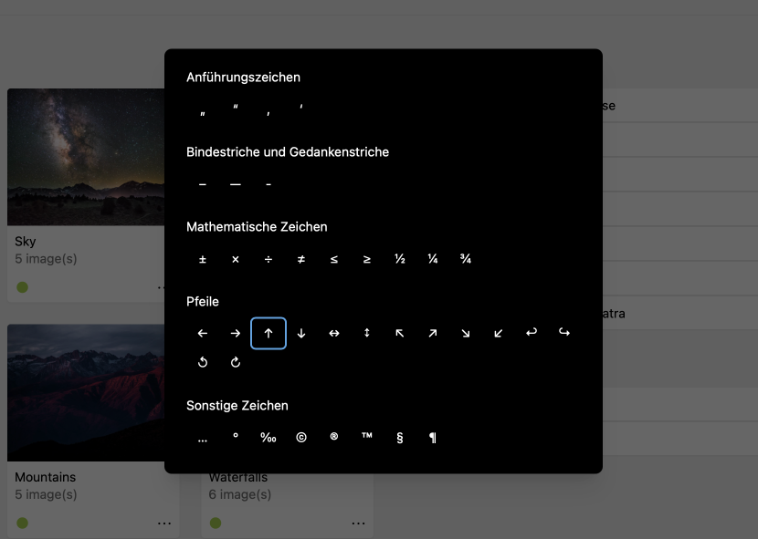

# Typo & Paste


**Typo & Paste** is a Kirby plugin that allows users to easily manage and insert special characters with multi-language support.



## Features

- **Multi-Language Support**: Supports various languages for characters and the user interface.
- **Custom Characters**: Users can define and add their own characters.
- **Multiple Access Points**: 
  - Panel toolbar button
  - Writer mark button
  - Keyboard shortcuts (`Option+T` / `Alt+T`)
- **Clipboard Copy**: Easily copy characters to the clipboard.

## Compatibility

This plugin is compatible with Kirby 4 and 5.

## Installation

### Composer

```bash
composer require philippoehrlein/typo-and-paste
```

### Manual Installation

1. Download and extract the plugin
2. Copy the `typo-and-paste` folder into `/site/plugins/`

## Configuration

### Access Points

The plugin provides three ways to access special characters:

#### 1. Panel Toolbar Button

In Kirby 5, configure the toolbar button:

```yaml
# In your blueprint
buttons:
  - typo-and-paste
  - preview
  - settings
  - languages
  - status
```

Or globally in your config:

```php
// site/config/config.php
return [
  'panel' => [
    'viewButtons' => [
      // Page view
      'page' => ['typo-and-paste', 'preview', 'settings', 'languages', 'status'],
      // Site view
      'site' => ['typo-and-paste', 'preview', 'languages']
    ]
  ]
];
```

#### 2. Writer Mark Button



To add the **Typo & Paste** button to the Writer toolbar, include `typo-and-paste` in your field's marks configuration:

```yaml
fields:
  article:
    label: Article
    type: writer
    toolbar:
      inline: true
      marks:
        - bold
        - italic
        - underline
        - strike
        - code
        - '|'
        - link
        - email
        - '|'
        - clear
        - '|'
        - typo-and-paste
```

#### 3. Textarea Button

To add the **Typo & Paste** button to the textarea, include `typo-and-paste` in your field's buttons configuration:

```yaml
fields:
  article:
    label: Article
    type: textarea
    buttons:
      - typo-and-paste
```

#### 4. Keyboard Shortcuts



- Use `Option+T` (Mac) or `Alt+T` (Windows/Linux) to open the character dialog from anywhere
- Navigate characters using arrow keys
- Press Enter to add the selected character to your clipboard

### Character Configuration

Define custom characters in your config:

```php
// site/config/config.php
return [
  'philippoehrlein.typo-and-paste' => [
    'characters' => [
      [
        'label' => [
          'en' => 'Quotation Marks',
          'de' => 'Anführungszeichen',
        ],
        'lang' => 'fr', // Optional: Show only for French content
        'characters' => ['«', '»', '‹', '›']
      ],
    ]
  ]
];
```

## Translations

The plugin includes a default set of translations for `en`, `de`, `fr`, `es`, `nl`, and `it`.
Add custom translations:

```php
// site/languages/en.php
return [
  'translations' => [
    'philippoehrlein.typo-and-paste.buttonTitle' => 'Special Characters',
    'philippoehrlein.typo-and-paste.copiedMessage' => '{character} copied to clipboard',
  ]
];
```

## Development

1. Clone the repository
2. Install dependencies: `composer install`
3. Run playground: `composer dev`
4. Open: [http://localhost:8000](http://localhost:8000)

## License

MIT License