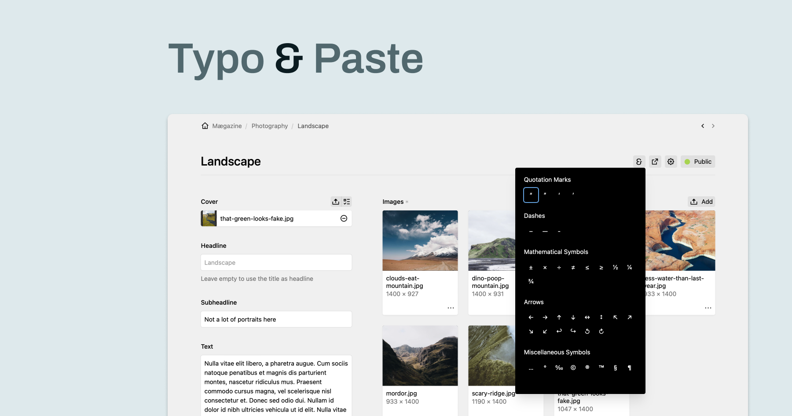

# Typo & Paste


**Typo & Paste** is a Kirby plugin that allows users to easily manage and insert special characters with multi-language support.



## Features

- **Multi-Language Support**: Supports various languages for characters and the user interface.
- **Custom Characters**: Users can define and add their own characters.
- **Clipboard Copy**: Easily copy characters to the clipboard.

## Installation

### Composer

Install the plugin via Composer:

```bash
composer require philippoehrlein/typo-and-paste
```

### Manual Installation

1. Download and extract the plugin.
2. Copy the `typo-and-paste` folder into the `/site/plugins/` directory of your Kirby installation.

## Configuration

### Options

You can configure the plugin in the `site/config/config.php` file. Here are the available options:

#### `translations`

You can customize the plugin's translations for different languages:

```php
'philippoehrlein.typo-and-paste.translations' => [
    'translations' => [
        'en' => [
            'button_title' => 'Special Characters',
            'copied_message' => '${character} copied to clipboard',
        ],
        'de' => [
            'button_title' => 'Sonderzeichen',
            'copied_message' => '${character} in die Zwischenablage kopiert',
        ],
        // Additional languages can be added here…
    ]
],
```

#### `characters`

Define the characters to be displayed by the plugin. The default characters are provided, but you can override them.
Additonaly you can use 'lang' to display a group of characters depending on the page language.


```php
'philippoehrlein.typo-and-paste' => [
    'characters' => [
        [
            'label' => [
                'en' => 'Quotation Marks',
                'de' => 'Anführungszeichen',
                // Additional translations can be added here…
            ],
            'lang' => 'fr',
            'characters' => ['«', '»', '‹', '›']
        ],
        // Additional characters and categories can be added here…
    ]
],
```

### Example Configuration

Here is an example configuration in `site/config/config.php`.

```php
return [
    'philippoehrlein.typo-and-paste' => [
        'translations' => [
            'en' => [
                'button_title' => 'Special Characters',
                'copied_message' => '${character} copied to clipboard',
            ],
            'de' => [
                'button_title' => 'Sonderzeichen',
                'copied_message' => '${character} in die Zwischenablage kopiert',
            ],
            // Additional languages can be added here...
        ],
        'characters' => [
            [
                'label' => [
                    'en' => 'Quotation Marks',
                    'de' => 'Anführungszeichen',
                    // Additional translations can be added here...
                ],
                'lang' => 'fr',
                'characters' => ['«', '»', '‹', '›']
            ],
            // Additional characters and categories can be added here...
        ]
    ]
];
```

## Usage

After installation and configuration, the plugin adds a button to the Kirby panel, allowing users to easily insert special characters into their content.

### Insert Characters

1. Open the Kirby panel.
2. Use the "Special Characters" button to select and insert characters.
3. Click on a character to copy it to your clipboard.

## Development

If you want to contribute to the development of this plugin, follow these steps:

1. Clone the repository.
2. Install dependencies using Composer.
3. Make your changes and test them in your Kirby installation.

## License

This plugin is open-source and available under the [MIT License](LICENSE.md).
